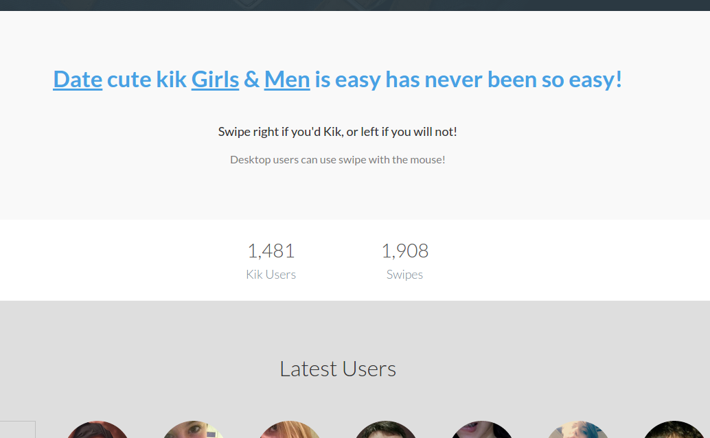

# Kikder Dating Swipe App

Kik App, you know..? This app integrates Kik and uses the HotOrNot game and the swiping feature from Tinder.
Kikder uses a custom PHP lightweight MVC framework as well.

A great, simple, and open source web app to date and communicate very easy with anyone!

## Requirements

* **Server** PHP 5.4 or newer

* **Database** MySQL/MariaDB 5.0.3 or newer

## Installation

Have a look to `installation - instruction.txt` file to know step-by-step how to set it up.

## Ambitious Dating Business?

If you are looking for a turnkey solution, a more powerful dating builder... I can advise you to look for [pH7CMS App Builder](https://github.com/pH7Software/pH7-Social-Dating-CMS).

## Contact Me?

Feel free to give me a shout at 📮 *hi `AT` ph7 `D0T` me* 😊

---

